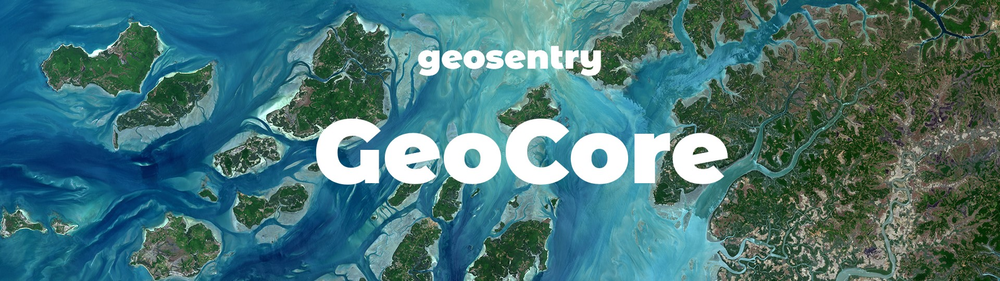

# geocore

Serverless Microservices for the GeoCore API, used internally for the core geospatial functionalities of the GeoSentry 🌍 Platform facilitated by the Terrarium package. The Services are built  with Docker, stored on Artifact Registry, deployed on Cloud Run and discoverable with Service Directory.

The repository contains the server runtimes for a handful of microservices that are packaged as Docker containers. The containers are hosted on GCP's Artifact Registry. The individual microservices are stitched together and exposed as a single endpoint using API Gateway. The OpenAPI Swagger spec is implemented in the [geosentry/cloud]() repository and deployed as part of its Terraform Manifest.

The repository contains a directory for each GeoCore service, each of which contain a **Dockerfile**, a **main.py**, a **README.md** and a **requirements.txt** file. These files define each service's build, server runtime, description and dependencies.

The 5 GeoCore Services are
- **chrono**
- **spatio**
- **topo**
- **spectral**
- **analytics**

The specs and details of each service is defined within its respective README file.

The [geosentry/eventhandlers](www.github.com/geosentry/eventhandlers) repository defines the serverless event-driven functions that operate around the GeoCore APIs and the entities it modifies.
The [geosenry/cloud](www.github.com/geosentry/cloud) repository defines the Terraform manifest for the cloud configuration. It also contains the metadata and resource configurations for the cloud services such as **Service Directory** and **Artifact Registry** as well as the individual **Cloud Run** services that make up the GeoCore API.
